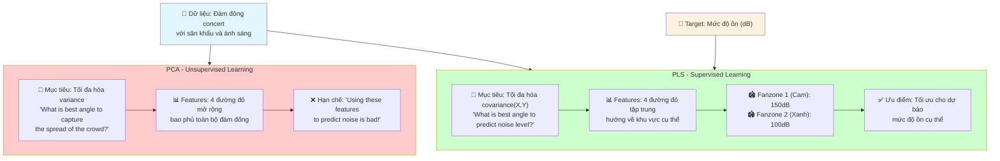

# So sánh PCA vs PLS: Minh họa với ví dụ dự báo mức độ ồn

## Mô tả hình ảnh

### PCA (Principal Component Analysis) - Bên trái

**Mục tiêu:** "What is best angle to capture the spread of the crowd?"
- **Phương pháp:** Tìm góc tốt nhất để nắm bắt sự phân tán của đám đông
- **Đặc điểm:** 
  - 4 đường đỏ mở rộng rộng rãi bao phủ toàn bộ khu vực đám đông
  - Tập trung vào việc tối đa hóa variance của dữ liệu đầu vào
  - **Hạn chế:** "Using these features to predict noise is bad!" - Không tối ưu cho việc dự báo mục tiêu cụ thể

### PLS (Partial Least Squares) - Bên phải

**Mục tiêu:** "What is best angle to **predict** noise level?"
- **Phương pháp:** Tìm góc tốt nhất để **dự báo** mức độ ồn
- **Đặc điểm:**
  - 4 đường đỏ tập trung hẹp hơn, hướng về các khu vực cụ thể
  - Có 2 Fanzone được đánh dấu:
    - **Fanzone 1** (màu cam): Gần sân khấu - 150dB
    - **Fanzone 2** (màu xanh lá): Xa sân khấu - 100dB
  - **Ưu điểm:** Tối ưu hóa covariance giữa features và target variable

## Code Mermaid để tạo sơ đồ



## Sơ đồ LaTeX cho blog

```latex
\begin{figure}[H]
    \centering
    \begin{tikzpicture}[
        node distance=2.5cm,
        pca/.style={rectangle, draw=red!60!black, fill=red!15, text width=3cm, text centered, minimum height=2cm, rounded corners=6pt, font=\small},
        pls/.style={rectangle, draw=green!60!black, fill=green!15, text width=3cm, text centered, minimum height=2cm, rounded corners=6pt, font=\small},
        arrow/.style={->, thick, gray!70!black, line width=2pt},
        title/.style={font=\large\bfseries, blue!80!black}
    ]
        % PCA Section
        \node[pca] (pca-goal) {PCA\\Unsupervised\\Maximize Variance};
        \node[pca, below of=pca-goal] (pca-features) {4 đường đỏ mở rộng\\Bao phủ toàn bộ đám đông};
        \node[pca, below of=pca-features] (pca-limit) {❌ Không tối ưu\\cho dự báo cụ thể};
        
        % PLS Section  
        \node[pls, right of=pca-goal, xshift=2cm] (pls-goal) {PLS\\Supervised\\Maximize Covariance(X,Y)};
        \node[pls, below of=pls-goal] (pls-features) {4 đường đỏ tập trung\\Hướng về khu vực cụ thể};
        \node[pls, below of=pls-features] (pls-zones) {Fanzone 1: 150dB\\Fanzone 2: 100dB};
        
        % Data source
        \node[title, above of=pca-goal, yshift=1cm] {Dữ liệu: Đám đông concert};
        
        % Arrows
        \draw[arrow] (pca-goal) -- (pca-features);
        \draw[arrow] (pca-features) -- (pca-limit);
        \draw[arrow] (pls-goal) -- (pls-features);
        \draw[arrow] (pls-features) -- (pls-zones);
        
        % Target connection
        \node[title, right of=pls-zones, xshift=2cm] {Target: Mức độ ồn};
        \draw[arrow] (pls-zones) -- (pls-zones -| pls-zones.east) -- ++(1,0) -- ++(0,1) -- ++(1,0);
    \end{tikzpicture}
    \caption{So sánh PCA vs PLS: PCA tập trung vào variance tổng thể, PLS tối ưu hóa cho dự báo mục tiêu cụ thể.}
    \label{fig:pca-vs-pls-comparison}
\end{figure}
```

## Kết luận

- **PCA**: Tối ưu hóa variance, không cần target variable, phù hợp cho exploratory analysis
- **PLS**: Tối ưu hóa covariance với target, cần target variable, phù hợp cho supervised learning
- **Ứng dụng trong dự án**: PLS được chọn vì cần dự báo Load (target variable) từ weather data
