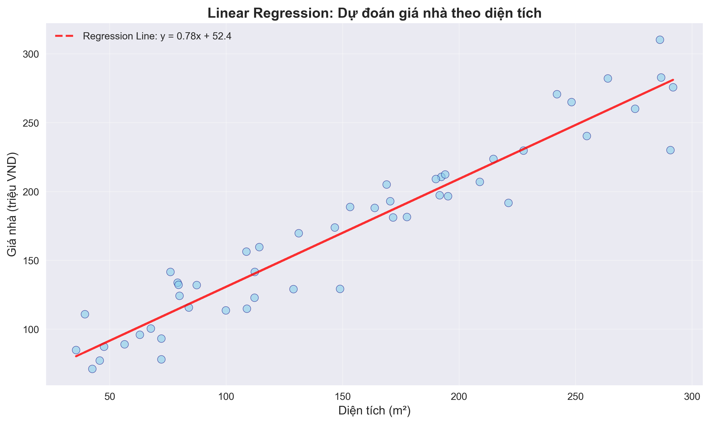
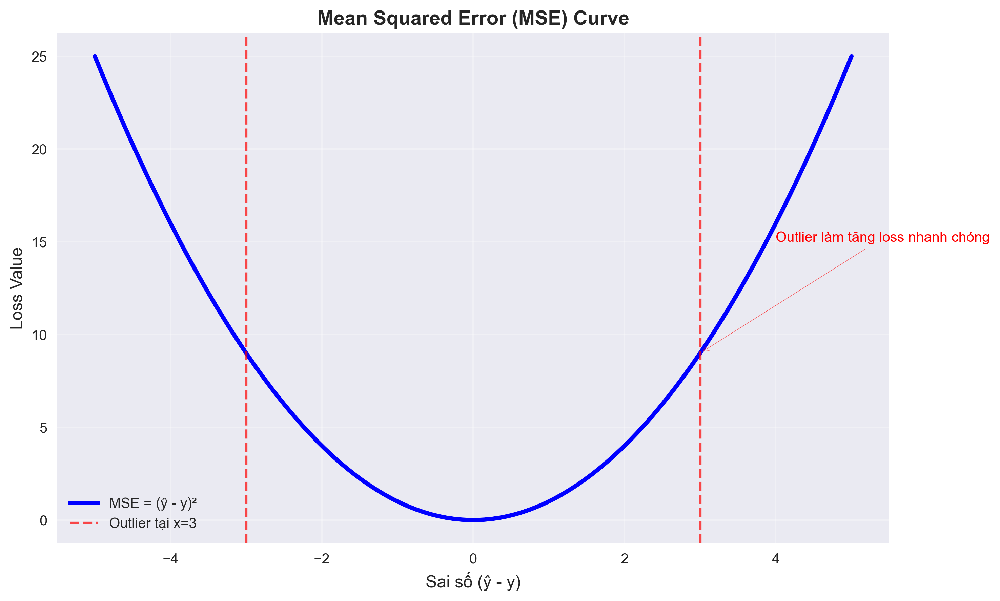
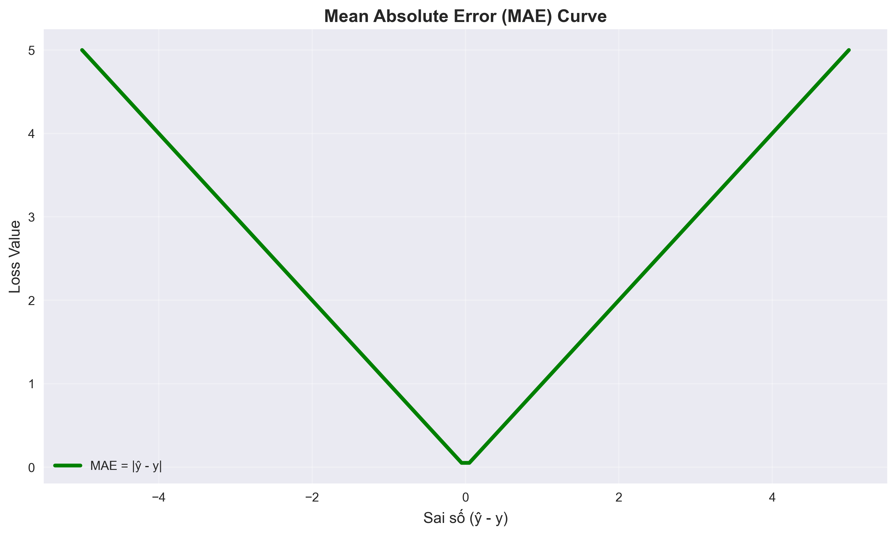
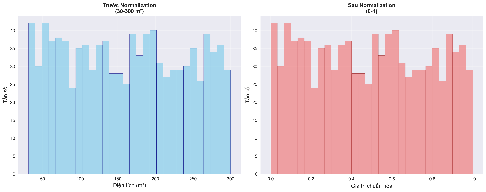
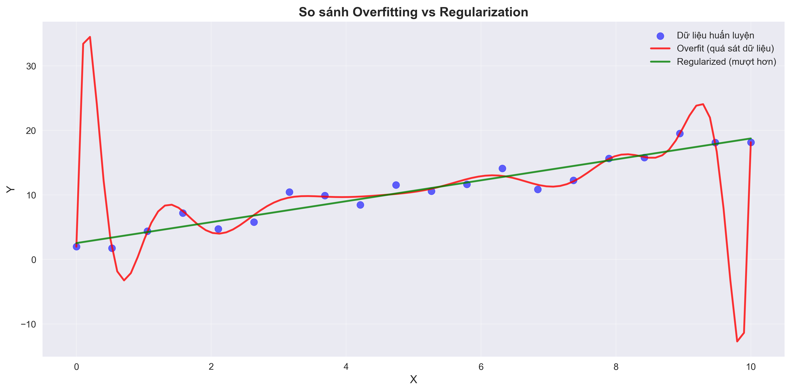
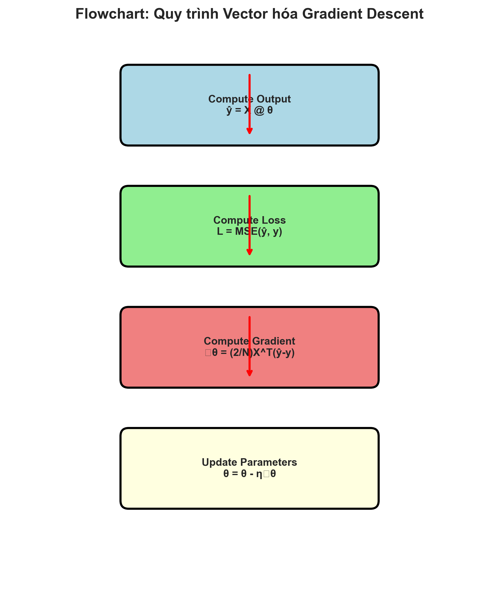
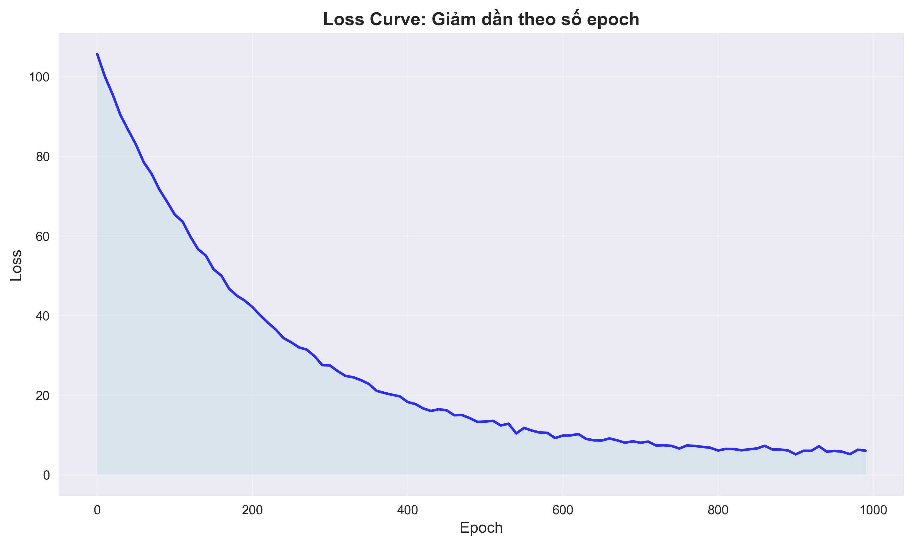

# 🧮 Hiểu Đơn Giản Về Linear Regression – Từ Loss Function Đến Vectorization

> Một hướng dẫn trực quan giúp bạn hiểu cách máy tính “học” đường thẳng tốt nhất qua dữ liệu — từ công thức cơ bản đến tối ưu bằng vector hóa.

---

## 1️⃣ Linear Regression Là Gì?

Linear Regression (Hồi quy tuyến tính) là mô hình cơ bản trong học máy, tìm **đường thẳng tốt nhất** mô tả mối quan hệ giữa **biến đầu vào (x)** và **biến đầu ra (y)**:

\[
\hat{y} = w x + b
\]

- **w**: độ dốc (weight)  
- **b**: giao điểm trục tung (bias)  
- **ŷ (y-hat)**: giá trị dự đoán  

Ví dụ:  
> Dự đoán giá nhà (`price`) theo diện tích (`area`):  
> `price = w * area + b`


*Hình 1: Minh họa Linear Regression với scatter plot của diện tích và giá nhà*

---

## 2️⃣ Loss Function – Cách Máy Tính “Đo” Sai Số

Để biết mô hình dự đoán tốt hay không, ta cần **hàm mất mát (Loss Function)** – đo độ lệch giữa dự đoán và thực tế.

---

### 🔹 Mean Squared Error (MSE)

\[
L = \frac{1}{N} \sum_{i=1}^{N} (\hat{y_i} - y_i)^2
\]

- Dễ đạo hàm, giúp việc tối ưu trơn tru.  
- Tuy nhiên **rất nhạy với outlier** (vì lỗi bị bình phương).

**Gradient của MSE:**
\[
\frac{\partial L}{\partial w} = 2x(\hat{y} - y), \quad 
\frac{\partial L}{\partial b} = 2(\hat{y} - y)
\]


*Hình 2: Biểu đồ đường cong MSE - outlier làm tăng loss nhanh chóng*

---

### 🔹 Mean Absolute Error (MAE)

\[
L = \frac{1}{N} \sum_{i=1}^{N} |\hat{y_i} - y_i|
\]

- Bền vững hơn với outlier (vì lỗi không bị bình phương).  
- Nhưng đạo hàm không xác định tại 0, khiến việc học chậm hơn.

**Gradient của MAE:**
\[
\frac{\partial L}{\partial w} = x \cdot \text{sign}(\hat{y} - y)
\]


*Hình 3: Biểu đồ đường cong MAE (hình chữ V) để so sánh với MSE*

---

### 🔹 Huber Loss – “Lấy Cái Hay Của Cả Hai”

Huber Loss kết hợp ưu điểm của MSE và MAE:

\[
L_\delta = 
\begin{cases}
\frac{1}{2}(\hat{y} - y)^2, & \text{nếu } |\hat{y} - y| \leq \delta \\
\delta \cdot |\hat{y} - y| - \frac{1}{2}\delta^2, & \text{nếu } |\hat{y} - y| > \delta
\end{cases}
\]

- Khi sai số nhỏ → giống MSE.  
- Khi sai số lớn → giống MAE.

🧠 **Hiểu nôm na:**  
Huber Loss giống như ta “mềm mại” với lỗi nhỏ, nhưng “khoan dung” với outlier.


*Hình 4: Biểu đồ Huber Loss - đoạn giữa là parabol (MSE), hai bên là tuyến tính (MAE)*

---

## 3️⃣ Chuẩn Hóa Dữ Liệu (Normalization)

Khi các đặc trưng (features) có thang giá trị khác nhau, việc học sẽ chậm hoặc không hội tụ.  
Giải pháp: **chuẩn hóa dữ liệu** về cùng phạm vi.

\[
x' = \frac{x - x_{min}}{x_{max} - x_{min}}
\]

Ví dụ: nếu diện tích nhà dao động từ 30–300 m², thì sau chuẩn hóa, giá trị chỉ nằm trong khoảng [0,1].


*Hình 5: Histogram trước và sau normalization - thang giá trị thay đổi từ 30-300 sang 0-1*

---

## 4️⃣ Regularization – Chống Overfitting

Khi mô hình học “quá kỹ” dữ liệu huấn luyện, nó dễ **overfit**, tức là học cả nhiễu.

Giải pháp là thêm điều khoản **phạt trọng số lớn** vào hàm loss:

\[
L_{reg} = (\hat{y} - y)^2 + \lambda(w_1^2 + w_2^2 + \dots)
\]

- **λ (lambda)**: hệ số điều chỉnh mức phạt.  
- Giúp mô hình “khiêm tốn” hơn, không quá phụ thuộc vào dữ liệu cụ thể.


*Hình 6: So sánh hai đường hồi quy - một đường fit "quá sát" dữ liệu (overfit) và một đường mượt hơn (regularized)*

---

## 5️⃣ Vectorization – Khi Toán Học Giúp Code Chạy Nhanh Hơn ⚡

Thay vì tính từng mẫu riêng lẻ, ta có thể **gom tất cả dữ liệu thành ma trận** và dùng phép nhân vector để cập nhật tham số cùng lúc.

### 🧩 Biểu diễn ma trận

\[
\mathbf{X} =
\begin{bmatrix}
x_1 & 1 \\
x_2 & 1 \\
\vdots & \vdots \\
x_N & 1
\end{bmatrix},
\quad
\boldsymbol{\theta} =
\begin{bmatrix}
w \\ b
\end{bmatrix},
\quad
\hat{\mathbf{y}} = \mathbf{X}\boldsymbol{\theta}
\]


*Hình 7: Sơ đồ vector hóa minh họa phép nhân ma trận X @ θ → ŷ*

---

### 🧮 Gradient Descent Dạng Vector

\[
\boldsymbol{\theta} = \boldsymbol{\theta} - \eta \cdot \frac{1}{N}\mathbf{X}^T ( \hat{\mathbf{y}} - \mathbf{y} )
\]

- **η (eta)**: learning rate  
- Tất cả phép tính được gói gọn trong vài dòng NumPy, cực kỳ nhanh.


*Hình 8: Flowchart quy trình vector hóa gồm 4 bước: Compute Output → Compute Loss → Compute Gradient → Update Parameters*

---

## 6️⃣ Tổng Kết

| Hàm mất mát | Ưu điểm | Nhược điểm | Phù hợp khi... |
|--------------|-----------|--------------|----------------|
| **MSE** | Dễ đạo hàm, ổn định | Nhạy với outlier | Dữ liệu sạch |
| **MAE** | Bền với outlier | Đạo hàm không mượt | Dữ liệu nhiễu |
| **Huber** | Kết hợp cả hai | Cần chọn δ | Có outlier nhẹ |

**Các kỹ thuật hỗ trợ:**  
- **Normalization:** giúp hội tụ nhanh hơn  
- **Regularization:** giảm overfitting  
- **Vectorization:** tối ưu tốc độ tính toán

---

## 📘 Kết Luận

Linear Regression là nền tảng cho mọi mô hình học máy.  
Hiểu rõ các loại **loss function**, cách **tính gradient**, và **vector hóa** giúp bạn nắm vững mọi mô hình sâu hơn như Logistic Regression, Neural Network hay CNN.

---

## 💻 Ví Dụ Python

```python
import numpy as np

# Data
X = np.array([[6.7, 1], [4.6, 1], [3.5, 1], [5.5, 1]])
y = np.array([[9.1], [5.9], [4.6], [6.7]])

# Initialize
theta = np.array([[0.049], [-0.34]])
eta = 0.01
N = len(y)

# Gradient Descent
for epoch in range(1000):
    y_pred = X @ theta
    grad = (2/N) * X.T @ (y_pred - y)
    theta -= eta * grad

print(theta)
```


*Hình 9: Loss curve giảm dần theo số epoch*

---

## ✍️ Gợi Ý Khi Làm Blog

- Thêm màu sắc nhẹ cho code block và công thức (Markdown MathJax).  
- Giữ mỗi hình một caption ngắn (“MSE curve”, “Huber Loss”, “Vectorized flow”).  
- Sử dụng cùng palette màu cho toàn bài (xanh nhạt hoặc cam đất).  
